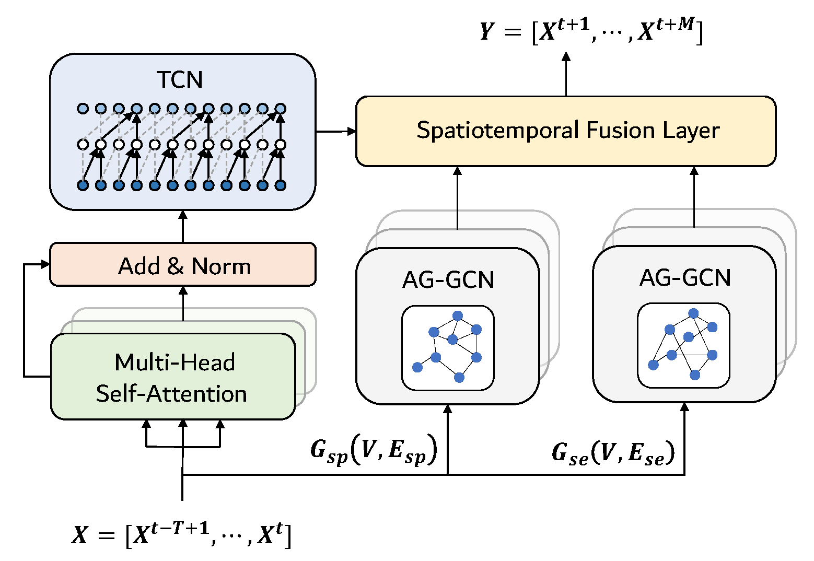

# STAG-GCN
Spatiotemporal Adaptive Gated Graph Convolution Network for Urban Traffic Flow Forecasting



## Requirements
- pytorch >= 1.4.0
- numpy >= 1.18.1
- scikit-learn >= 0.21.0
- pytorch geometric >= 1.4.1
- pyaml
- scipy
- tqdm

## Data 
The data in paper can be download here: [GAIA Open Dataset](https://outreach.didichuxing.com/research/opendata/)

## Graph Construction
Run the following command to generate semantic neighbor adjacency matrix.
```bash
# Achieve DTW distance matrix
python tools/DTW_embedding.py
# Set threshold to generate semantic neighbor adjacency matrix
python tools/DTW_matrix_analysis.py
```

## Model Training & Testing
```bash
# Training process
python train.py --config_filename='config.yaml'
# Testing process
python test.py --config_filename='config.yaml'
```
